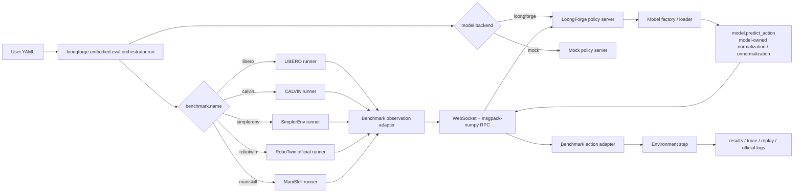

# LoongForge-VLA Offline Eval — User Guide

LoongForge-VLA ships an offline evaluation module under
`loongforge/embodied/eval` that runs a benchmark client and a model policy
server as two separate processes connected by a WebSocket / msgpack-numpy RPC.
It currently serves LoongForge **pi0.5** and **X-VLA** as policy backends, and
supports five benchmarks: **LIBERO**, **CALVIN**, **SimplerEnv**, **RoboTwin
(2.0)**, and **ManiSkill**.

The entire user surface is a single YAML file plus a launcher script — no
Python entrypoint editing. This guide covers what is supported, how to run it,
how to configure it per benchmark, and how to extend it to new models.

---

## 1. Support Matrix

### 1.1 What runs today

| Model | LIBERO | CALVIN | SimplerEnv (WidowX) | RoboTwin 2.0 | ManiSkill |
|---|---|---|---|---|---|
| **pi0.5** | Task success (finetuned) | Not yet scored — needs a CALVIN-domain checkpoint | Not yet scored — no public Bridge/WidowX finetune | Task success (`pi0.5_robotwin2` + `pi05_aloha_14d`) | Not yet scored — no matching checkpoint |
| **X-VLA** | Task success (~94% object suite) | Not yet scored — needs official ABC_D weights | Task success (X-VLA-WidowX + SimplerEnv patch) | Task success (X-VLA-RoboTwin2 + `ee6d_dual`) | Not yet scored — no matching open weight |

"Task success" means at least one episode has passed the official or local
success criterion. "Not yet scored" combos still ship a runnable YAML with
`server.random_init: true` so the RPC path can be verified without any
checkpoint.

### 1.2 Ready-to-run combinations

Each combo below has a public YAML that only needs `/path/to/...` filled in.

| Combo | Public weight | Config |
|---|---|---|
| pi0.5 + LIBERO | pi0.5 LIBERO finetune (openpi `pi05_libero` family or local `model.safetensors` + `dataset_statistics.json`) | `examples/embodied/pi05/eval/configs/libero/object_smoke.yaml` |
| pi0.5 + RoboTwin | pi0.5 RoboTwin-2.0 joint finetune + stats (see §5.2) | `examples/embodied/pi05/eval/configs/robotwin/adjust_bottle_smoke.yaml` |
| X-VLA + LIBERO | [2toINF/X-VLA-LIBERO](https://huggingface.co/2toINF/X-VLA-LIBERO) | `examples/embodied/xvla/eval/configs/libero/libero_weight_object_smoke.yaml` |
| X-VLA + RoboTwin | [2toINF/X-VLA-RoboTwin2](https://huggingface.co/2toINF/X-VLA-RoboTwin2) | `examples/embodied/xvla/eval/configs/robotwin/adjust_bottle_smoke.yaml` |
| X-VLA + SimplerEnv | [2toINF/X-VLA-WidowX](https://huggingface.co/2toINF/X-VLA-WidowX) | `examples/embodied/xvla/eval/configs/simplerenv/widowx_stack_cube_smoke.yaml` |

For task success on X-VLA + SimplerEnv, the upstream SimplerEnv also needs a
one-time patch — see §6.3 and `examples/embodied/xvla/eval/SIMPLERENV_PATCH_en.md`.

### 1.3 Key protocol fields per combo

| Combo | Required config |
|---|---|
| pi0.5 + LIBERO | `action_dim: 7`, `action_horizon: 50`; matching `dataset_statistics.json` (q01/q99) |
| pi0.5 + RoboTwin | `action_dim: 14`, `action_horizon: 32`; `action_bridge: pi05_aloha_14d`; `dataset_statistics_path` (see §5.2) |
| X-VLA + LIBERO | `domain_id: 3`; `action_postprocess: ee6d_to_axis_angle`; `server.state_format: ee6d`; `max_steps: 800` |
| X-VLA + RoboTwin | `domain_id: 6`; `action_bridge: ee6d_dual` |
| X-VLA + SimplerEnv | `domain_id: 0`; `max_steps: 1200`; `control_mode: arm_pd_ee_target_base_pose_gripper_pd_joint_pos`; `action_postprocess: ee6d_to_simpler_abs_euler`; requires SimplerEnv patch |

---

## 2. Quick Start

### 2.1 Environments

Two conda environments are involved, kept separate on purpose:

- **Benchmark side** (one per benchmark) — LIBERO, CALVIN, SimplerEnv,
  RoboTwin, or ManiSkill. Example: `/path/to/envs/libero/bin/python`.
- **Model side** — the same LoongForge environment used for training.
  Example: `/path/to/envs/loongforge/bin/python`.

Per-benchmark dependencies and known-good versions are documented in
`benchmark_envs.md`.

### 2.2 Run pi0.5 on LIBERO

```bash
cd /path/to/LoongForge-VLA

# 1. Edit /path/to/... in the YAML:
#    examples/embodied/pi05/eval/configs/libero/object_smoke.yaml
# 2. Launch:
examples/embodied/pi05/eval/run_libero_eval.sh
```

The launcher wraps a single Python entry:

```bash
"${BENCHMARK_PYTHON}" -m loongforge.embodied.eval.orchestrator.run \
  --config "${CONFIG}"
```

Overridable env vars: `REPO_ROOT`, `CONFIG`, `BENCHMARK_PYTHON`,
`CUDA_VISIBLE_DEVICES`, `LD_LIBRARY_PATH`, `VK_ICD_FILENAMES`.

### 2.3 Run X-VLA on LIBERO

```bash
cd /path/to/LoongForge-VLA
# Edit /path/to/... in configs/libero/libero_weight_object_smoke.yaml
examples/embodied/xvla/eval/run_libero_eval.sh
```

The default YAML runs one task × one episode. To run the full object suite,
raise `max_tasks` and `episodes_per_task` in the same YAML — file-header
comments list the options.

---

## 3. Configuration

### 3.1 YAML structure

Minimal skeleton (pi0.5 + LIBERO):

```yaml
benchmark:
  name: libero
  suite: libero_object      # optional: libero_spatial | libero_goal | libero_10
  max_tasks: 1
  episodes_per_task: 1
  max_steps: 300
  num_steps_wait: 10

model:
  backend: loongforge       # or `mock` for RPC-only smoke
  model_type: pi05          # or `xvla`
  name: loongforge-pi05
  action_dim: 7
  state_dim: 7
  action_horizon: 50
  max_action_dim: 32
  max_state_dim: 32
  compile_model: false

server:
  host: 127.0.0.1
  port: 12093
  health_port: 12094
  python: /path/to/envs/loongforge/bin/python
  log: /path/to/reports/pi05/libero/object_smoke/policy_server.log
  start_timeout_sec: 900
  ckpt_path: /path/to/checkpoint_or_model_dir
  dataset_statistics_path: /path/to/dataset_statistics.json
  tokenizer_path: /path/to/paligemma-3b-pt-224
  use_bf16: false
  loongforge_root: /path/to/LoongForge-VLA

run:
  output_dir: /path/to/reports/pi05/libero/object_smoke
  seed: 7
  save_trace: true
  save_replay: true

timeouts:
  policy_call_ms: 600000
  per_step_sec: 600
  per_episode_sec: 900
```

### 3.2 Field reference

| Field | Meaning |
|---|---|
| `benchmark.name` | Selects the runner: `libero`, `calvin`, `simplerenv`, `robotwin`, `maniskill`. |
| `model.backend` | `loongforge` runs a real model server. `mock` starts a protocol-only server for RPC smoke. |
| `model.*` | Model-structure fields matching each `ModelConfig` dataclass (`action_dim`, `action_horizon`, `compile_model`, …). |
| `server.ckpt_path` | Directory containing `model.safetensors`, or the weight file itself. |
| `server.random_init: true` | Skip checkpoint load; useful when no domain weight is available. |
| `server.dataset_statistics_path` | Passed through to model `predict_action()` for model-owned unnormalization. |
| `server.chunk_execute_steps` (X-VLA only) | Open-loop horizon truncation. `10` = official X-VLA LIBERO style; `0` = factory default (10 for X-VLA); `-1` = no truncation. |
| `server.python` | Interpreter used to launch the policy server. |
| `server.log` | Path to the policy server log file. Conventionally `policy_server.log` under the run directory. |
| `run.output_dir` | Run directory. Defaults to a timestamped subdirectory (see §4.2). |
| `run.timestamped_output` | Default `true`; set `false` to reuse a fixed `output_dir` (e.g. during debugging). |
| `run.save_trace` / `run.save_replay` | Disable both when tight on disk to keep only `results.jsonl`, `summary.csv`, `suite_summary.csv`, and the policy log. |

Protocol knobs (`benchmark.action_bridge`, `benchmark.domain_id`,
`benchmark.action_postprocess`, `server.state_format`, …) are YAML-only and
per-benchmark. See §5 for which combos need which.

### 3.3 Where configs live

```text
examples/embodied/<model>/eval/
  configs/
    <benchmark>/*.yaml     # one public YAML per benchmark
  run_<benchmark>_eval.sh  # launcher
```

All shipped YAMLs use `/path/to/...` placeholders. Do not commit
machine-specific absolute paths.

---

## 4. Per-Benchmark Guides

Each subsection covers what the shipped YAML runs by default, what to tweak
for a full sweep, and any benchmark-specific gotchas.

### 4.1 LIBERO

Shipped YAMLs:

- pi0.5 (task success): `examples/embodied/pi05/eval/configs/libero/object_smoke.yaml`
- X-VLA (task success): `examples/embodied/xvla/eval/configs/libero/libero_weight_object_smoke.yaml`

Default suite is `libero_object`. Change `suite` (`libero_object`,
`libero_spatial`, `libero_goal`, `libero_10`), `max_tasks`, and
`episodes_per_task` in the same YAML for a full sweep. X-VLA typically needs
`max_steps: 800` and `chunk_execute_steps: 10`.

### 4.2 RoboTwin

RoboTwin is launched via the official `script/eval_policy.py`; the bridge
lives in `loongforge/embodied/eval/bridges/robotwin_policy.py`. Which
protocol runs is picked by `benchmark.action_bridge` (or, for models that
own the choice, `model.robotwin_action_bridge`) — set in YAML only.

| `action_bridge` | Role | Control | Notes |
|---|---|---|---|
| `strict_14d` | Default 14D joint actions | `take_action` on joint qpos | Model must output ≥14D; no `adapt_to_pi`. |
| `duplicate_7d` | 7D → 14D | `take_action` on joint qpos | Connectivity check only. Not a real score. |
| `pi05_aloha_14d` | pi0.5 RoboTwin formal protocol | Joint qpos | openpi Aloha: `adapt_to_pi` decode state → model → delta→abs → `adapt_to_pi` encode. |
| `ee6d_dual` | X-VLA RoboTwin formal protocol | `take_action(..., action_type='ee')` | 20D ee6d, three views (head/left/right), proprio built inside the bridge from the last commanded EE action. |

Both `strict_14d` and `duplicate_7d` share the same default code path; only
`pi05_aloha_14d` and `ee6d_dual` have dedicated protocol handling.

#### pi0.5 + RoboTwin — task success

Key YAML fields:

```yaml
benchmark:
  name: robotwin
  task_name: adjust_bottle
  task_config: demo_clean
  action_bridge: pi05_aloha_14d
  max_steps: 300
model:
  model_type: pi05
  action_dim: 14
  state_dim: 14
  action_horizon: 32
server:
  ckpt_path: /path/to/pi0.5_robotwin2
  dataset_statistics_path: examples/embodied/pi05/eval/assets/pi05_robotwin2_dataset_stats.json
```

The stats file `pi05_robotwin2_dataset_stats.json` is derived from the
openpi `norm_stats.json` inside the pi0.5 RoboTwin-2.0 weight package, with
only the top-level keys renamed for LoongForge's q99 unnormalization:

| Item | Value |
|---|---|
| Source file (in weight package) | `assets/pi0.5_clean_randomize_joint_training/norm_stats.json` |
| Source shape | `{"norm_stats": {"state": {mean,std,q01,q99}, "actions": {...}}}` |
| LoongForge shape | `{"observation.state": {...}, "action": {...}}` |
| Values | Identical to source; only keys renamed. |
| In-repo copy | `examples/embodied/pi05/eval/assets/pi05_robotwin2_dataset_stats.json` |

Generator snippet (openpi-style checkpoint → LoongForge stats):

```python
import json
from pathlib import Path

src = Path("/path/to/pi0.5_robotwin2/assets/pi0.5_clean_randomize_joint_training/norm_stats.json")
raw = json.loads(src.read_text())["norm_stats"]
out = {"observation.state": raw["state"], "action": raw["actions"]}
Path("pi05_robotwin2_dataset_stats.json").write_text(json.dumps(out, indent=2))
```

Launch:

```bash
cd /path/to/LoongForge-VLA
CONFIG=examples/embodied/pi05/eval/configs/robotwin/adjust_bottle_smoke.yaml \
  examples/embodied/pi05/eval/run_robotwin_eval.sh
```

#### X-VLA + RoboTwin — task success

```bash
cd /path/to/LoongForge-VLA
CONFIG=examples/embodied/xvla/eval/configs/robotwin/adjust_bottle_smoke.yaml \
  examples/embodied/xvla/eval/run_robotwin_eval.sh
```

Aligned with the official `evaluation/robotwin-2.0` protocol: `domain_id: 6`,
`action_bridge: ee6d_dual`, weights e.g. `/path/to/X-VLA-RoboTwin2`.

#### RoboTwin without a formal weight

The public YAML also supports connectivity checks. Edit the same YAML:

- `server.random_init: true`, `max_steps: 5` — random 14D output, verifies
  the official runner is reachable.
- `action_bridge: duplicate_7d` (with `model.action_dim: 7`) — interface-only
  check. Not a real score.
- `action_bridge: strict_14d` — raw 14D joints, no `adapt_to_pi`. Not the
  openpi formal protocol.

### 4.3 SimplerEnv

X-VLA + SimplerEnv is the task-success combo. pi0.5 has no public Bridge or
WidowX finetune yet, so its YAML runs with `random_init: true` for
connectivity only.

Shipped YAMLs:

- pi0.5 (random-init): `examples/embodied/pi05/eval/configs/simplerenv/widowx_stack_cube_smoke.yaml`
- X-VLA (task success): `examples/embodied/xvla/eval/configs/simplerenv/widowx_stack_cube_smoke.yaml`

Switch Bridge tasks (eggplant, carrot, spoon, …) via `task_name`,
`robot_setup`, and `scene_name` in the same YAML. The runner re-execs before
importing SAPIEN so `LD_LIBRARY_PATH` and `VK_ICD_FILENAMES` take effect.

For X-VLA task success, upstream SimplerEnv also needs a one-time patch to
enable absolute EE control — see §6.3.

### 4.4 CALVIN

CALVIN is a long-horizon Franka language-manipulation benchmark (5 subtasks
per sequence). Metrics: `success_count`, average length, per-task success
rates. `benchmark.dataset_path` must point at a tree containing
`validation/`.

Neither pi0.5 nor X-VLA has a CALVIN-domain checkpoint currently, so the
shipped YAMLs use `server.random_init: true` for connectivity only:

- `examples/embodied/pi05/eval/configs/calvin/smoke.yaml`
- `examples/embodied/xvla/eval/configs/calvin/smoke.yaml`

With a CALVIN-domain checkpoint, set `random_init: false` and fill
`ckpt_path` / `dataset_statistics_path`. For X-VLA, the formal protocol is
`domain_id: 2`, `action_postprocess: ee6d_to_calvin_abs`.

### 4.5 ManiSkill

ManiSkill is a SAPIEN-based GPU-friendly manipulation suite. No public
open-weight combo scores today, so the shipped YAMLs run PickCube with
`random_init: true`:

- `examples/embodied/pi05/eval/configs/maniskill/pick_cube_smoke.yaml`
- `examples/embodied/xvla/eval/configs/maniskill/pick_cube_smoke.yaml`

Defaults: `PickCube-v1`, `pd_ee_delta_pose`, 7D action. Change `task` and
`obs_mode` (rgbd vs state) in the YAML.

Proprio note: for the Panda robot, when `qpos` is 9D (7 arm + 2 finger), the
adapter emits an 8D `model_state` = 7 joints + the mean of the two finger
joints (matches RLinf / openpi ManiSkill layout). The structured `state`
still carries full `qpos`. Only the `base_camera` view is packed.

> **Not the same as RLinf PutOnPlate.** RLinf's pi0.5 ManiSkill SFT is
> trained on `PutOnPlateInScene25Main-v3` (WidowX Bridge real2sim), not
> stock `PickCube-v1` + Panda. LoongForge does not ship that environment;
> the PickCube YAML only exercises the ManiSkill runner and RPC path.

---

## 5. Outputs

### 5.1 File layout

Under `run.output_dir`, direct-rollout benchmarks (LIBERO, CALVIN,
SimplerEnv, ManiSkill) write:

| File | Meaning |
|---|---|
| `results.jsonl` | One row per episode. |
| `summary.csv` | Task-level aggregate. |
| `suite_summary.csv` | Suite-level aggregate. |
| `artifacts/.../replay_*.gif` | Optional replay GIF. |
| `artifacts/.../trace_*.json` | Optional per-step action trace. |
| `policy_server.log` | Policy server stdout/stderr. |

Under disk pressure or for interface-only checks, set `run.save_replay: false`
and `run.save_trace: false` to keep only the four summary files.

RoboTwin uses the official evaluator and additionally collects deploy
config, `_result.txt`, bridge `trace.json`, and any available `mp4` videos
under `run.output_dir/artifacts/robotwin/<task_name>/<task_config>/`. Videos
stay in the official `mp4` format; no GIF conversion is forced.

### 5.2 Report directory conventions

```text
loongforge/embodied/eval/reports/
  <model>/
    <benchmark>/
      <run_name>/
        policy_server.log
        results.jsonl
        summary.csv
        suite_summary.csv
        artifacts/
          ...
```

`run.output_dir` should point at a stable run-tag directory such as
`reports/pi05/robotwin/adjust_bottle_smoke`. The unified entry defaults to
`run.timestamped_output: true` and creates `<yyyymmdd_hhmmss>_<run_tag>`
under the parent directory. `reports/` is local-only and not committed. To
reuse a fixed directory for debugging, set `run.timestamped_output: false`.

### 5.3 RoboTwin per-episode aggregation

The official RoboTwin evaluator loops until `test_num` **valid** episodes
(expert_check may skip seeds) and writes a single success rate in
`_result.txt`. LoongForge does **not** collapse that into one row.

Instead, the runner parses official log lines of the form
`Success rate: suc/test_num => …, current seed: S` and writes one
`results.jsonl` row per completed episode with `success` ∈ {0, 1}. Each row
also carries the overall `success_rate` and `n_episodes` so `summary.csv`
matches the LIBERO-style per-episode aggregate. If log parsing finds no
episode lines, the runner falls back to a single row from `_result.txt`.

---

## 6. Troubleshooting

### 6.1 SAPIEN / Vulkan (SimplerEnv, RoboTwin, ManiSkill)

SAPIEN-based benchmarks need a working Vulkan ICD, not just a visible GPU.
If `vulkaninfo` reports only `llvmpipe` / `lavapipe`, visual observations,
camera, and replay may segfault; a state-only rollout passing does not
prove the visual path works.

Quick check:

```bash
LD_LIBRARY_PATH=/path/to/nvidia_lib:/usr/lib64:${LD_LIBRARY_PATH:-} \
VK_ICD_FILENAMES=/path/to/nvidia_lib/10_nvidia.json \
vulkaninfo
```

Expect `deviceName = NVIDIA ...` and `driverName = NVIDIA`. Set
`LD_LIBRARY_PATH`, `VK_ICD_FILENAMES`, and `XDG_RUNTIME_DIR` **before**
importing SAPIEN / svulkan2 / ManiSkill / the renderer; the SimplerEnv
runner already re-execs the Python process for this reason. Changing
`LD_LIBRARY_PATH` after Python starts is usually insufficient.

### 6.2 Disk pressure

Long LIBERO sweeps have hit `No space left on device` while saving replay
artifacts — the model server itself is fine. Set `run.save_replay: false`
and `run.save_trace: false` to keep only `results.jsonl`, `summary.csv`,
`suite_summary.csv`, and `policy_server.log`.

### 6.3 SimplerEnv absolute EE control (X-VLA)

Upstream `simpler-env/SimplerEnv` does not ship absolute EE control by
default, but X-VLA emits absolute EE poses. Two options:

- Use the [`255isWhite/SimplerEnv`](https://github.com/255isWhite/SimplerEnv)
  fork (the fork used by the official X-VLA SIMPLER evaluation), or
- Apply the two local patches documented in
  `examples/embodied/xvla/eval/SIMPLERENV_PATCH_en.md`.

Without either, the environment either errors at construction with a
missing control mode, or silently applies absolute actions as deltas and
never succeeds.

---

## 7. Adding a New Model

To integrate a model beyond pi0.5 / X-VLA, reuse the shared `predict_action`
interface and `GenericPredictActionPolicy`. Keep benchmark protocol and
adapters unchanged; put model differences in a thin factory. Do not fork
benchmark runners or patch training-tree LoongForge source.

For model semantics (action space, absolute vs delta, postprocess, proprio
layout, normalization ownership, `domain_id` and other private fields,
chunk length, eval horizon), see `model_integration_guide.md` for the pi0.5
vs X-VLA side-by-side. The contract for `predict_action` itself is in
`predict_action_interface.md`.

### 7.1 Recommended path

1. **Implement the shared inference API**:

   ```python
   def predict_action(images, instructions, state=None, dataset_stats=None):
       ...
   ```

   Output may be `[D]`, `[H, D]`, or `[B, H, D]`; eval normalizes to
   `[H, action_dim]`. If model dim > required `action_dim`, eval truncates;
   if smaller, it errors.

2. **Add or reuse a model factory.** The factory owns only private logic
   (import, config / tokenizer / processor, checkpoint, device / dtype,
   compile, metadata) and returns a `predict_action` model plus metadata.
   Do not clean benchmark-native observation / state structures here.

3. **Reuse `GenericPredictActionPolicy`.** It owns eval RPC, image views,
   chunk cache, latency, metadata, dataset stats, shape checks, and
   dimension truncation. Do not copy a full policy adapter per model.

4. **Register the factory** with `@register_factory("<model_type>")` (see
   `loongforge/embodied/eval/factories/registry.py`) and make sure the
   module is imported so registration runs.

5. **Add YAML examples.** At least one config per integrated benchmark. Each
   should include `benchmark.name`, `model.backend`, `model.model_type`,
   model paths, stats path, server env, and output dir.

6. **Run smoke tests.** Verify server health, WebSocket RPC,
   `predict_action` shape, action dim, model-side stats handling, and
   result files. For SAPIEN benchmarks, verify the Vulkan ICD first (§6.1).

### 7.2 Adapter ↔ model state boundary

Adapters may keep a structured `state` for trace / debug / env action
conversion, but must not hand a benchmark-native dict to the model.
Everything the model consumes goes through `model_state`:

- **RoboTwin adapter**: `model_state` is the 14D `joint_action.vector`. With
  `action_bridge: ee6d_dual`, the bridge overrides this and builds a 20D
  ee6d proprio internally from the last commanded EE action.
- **ManiSkill adapter**: numeric `model_state` from `qpos` (9D → 8D as
  described in §4.5); not `None` when an agent state is present.
- **LIBERO / CALVIN / SimplerEnv**: proprio may stay unset (`model_state:
  None`) unless the YAML sets `server.state_format` (e.g. X-VLA `ee6d`) and
  the adapter builds one.
- If the model needs state, the adapter must emit a numeric, well-shaped
  `model_state` (`np.ndarray` or list), never a raw dict.
- `GenericPredictActionPolicy` only forwards RPC `state`; factories do not
  clean benchmark-native state.

### 7.3 Minimal checklist

- `predict_action_interface.validate_predict_action_model(model)` passes.
- `predict_action(images, instructions, state=None, dataset_stats=None)`
  normalizes output to `[H, action_dim]`.
- Action unnormalization (q99 / mean-std / …) lives **inside**
  `predict_action`; eval only forwards `dataset_stats`. Env-space
  conversion belongs to `action_postprocess` or the RoboTwin
  `action_bridge`, never to the model.
- Factory registered via `@register_factory("<model_type>")`; `build()`
  returns `PredictActionModelSpec`; `predict_action` tolerates a warmup
  call with an empty instruction and a zero-filled image.
- YAML includes `benchmark.name`, `model.backend`, `model.model_type`,
  `server.python` and `ckpt_path` (or `random_init: true`), and
  `run.output_dir`. Protocol knobs (`action_bridge`, `domain_id`,
  `action_postprocess`, …) are YAML-only.
- At least one config per target benchmark plus a smoke run: health, RPC,
  action shape, result files; SAPIEN → Vulkan ICD.
- After changing shared runner / adapter / bridge / generic policy code,
  regression-test known task-success combos (at minimum pi0.5 × LIBERO).

---

## 8. Architecture (optional deep dive)

### 8.1 End-to-end flow



### 8.2 Data path

1. `--config <yaml>` selects the runner (`benchmark.name`) and the policy
   backend (`model.backend`).
2. The orchestrator starts the benchmark client and launches an independent
   LoongForge policy server via `server.python`.
3. The runner reads raw observations; the benchmark adapter converts them
   to the canonical schema (images, structured state, optional
   `model_state`, language, episode / task metadata).
4. The runner sends RPC over WebSocket + msgpack-numpy. Benchmark-native
   structured state stays on the adapter / trace side; only `model_state`
   reaches the model server. The benchmark side does not import LoongForge
   model code.
5. The policy server picks a model factory from YAML. The factory imports
   the model, loads a checkpoint (or random-inits when
   `server.random_init: true`), and returns a model implementing
   `predict_action`.
6. `GenericPredictActionPolicy` owns eval RPC, image-view packing,
   action-chunk cache, latency, metadata, shape checks, and action-dim
   truncation, then calls
   `model.predict_action(images, instructions, state=model_state,
   dataset_stats=dataset_stats)`.
7. `predict_action` decides whether to consume `dataset_stats` and owns
   private state normalization / action unnormalization. Benchmark-native
   dict state is not cleaned in the factory; adapters must emit a clean
   `model_state` when proprio is required.
8. The returned action chunk goes back to the client; the action adapter
   converts it to env actions (7D for LIBERO / SimplerEnv / ManiSkill, 14D
   bimanual for RoboTwin joint, 20D ee6d for RoboTwin `ee6d_dual`).
9. After each step the runner logs episode results, traces, replays, or
   RoboTwin official artifacts. Policy server stdout/stderr go to the file
   named by `server.log`.

---

## 9. Related Docs

| Doc | Notes |
|---|---|
| [README.md](README.md) | Module scope, quick start, config index. |
| [model_integration_guide.md](model_integration_guide.md) | New-model semantic checklist. |
| [predict_action_interface.md](predict_action_interface.md) | **For model owners:** `predict_action` contract (signature, shapes, unnormalization ownership, postprocess vs model). |
| [benchmark_envs.md](benchmark_envs.md) | Per-benchmark conda envs and dependencies. |
| `examples/embodied/xvla/eval/SIMPLERENV_PATCH_en.md` | SimplerEnv absolute EE control patch. |
