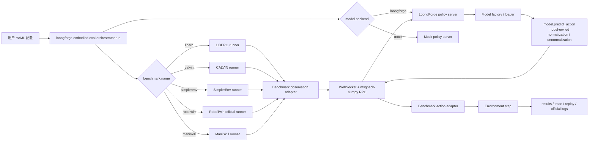

# LoongForge-VLA 离线评测用户说明

本文档说明如何在 `/workspace/LoongForge-VLA/loongforge/embodied/eval` 中使用统一 YAML 配置运行 LoongForge-VLA 离线评测。当前主要接入 LoongForge pi05 policy server，并已验证 LIBERO、CALVIN、SimplerEnv、RoboTwin 和 ManiSkill 的 smoke 链路。

## 1. 模块定位

评测模块把 benchmark client 和 model server 解耦：

- benchmark 侧负责环境 reset/step、observation/action adapter、结果记录。
- model 侧通过独立 policy server 提供动作预测。
- 双方通过 WebSocket + msgpack-numpy RPC 通信。
- 用户入口是 YAML；命令行只传 `--config`。
- LoongForge 源码不在 eval 适配中被修改；兼容逻辑放在 `eval/servers`。

### 1.1 基于 LoongForge 的整体流程



### 1.2 数据链路

1. 用户只通过 `--config <yaml>` 启动评测，YAML 中的 `benchmark.name` 决定 benchmark runner，`model.backend` 决定 policy server backend。
2. orchestrator 读取 YAML 后启动 benchmark client，并按 `server.python` 拉起独立的 LoongForge pi05 policy server。
3. benchmark runner 从环境拿到原始 observation，由 benchmark-side adapter 转成统一 observation schema，包括图像、结构化状态、可传给模型的 `model_state`、语言指令和 episode/task 元信息。
4. runner 通过 WebSocket + msgpack-numpy RPC 发给 policy server；benchmark-native 结构化状态只留在 adapter/trace 侧，模型 server 只接收 `model_state`。benchmark 侧不直接 import 或修改 LoongForge 模型代码。
5. LoongForge policy server 根据 YAML 选择 model factory，factory 负责 import 模型、注册模型私有 config、加载 checkpoint 或按 `model.random_init: true` 随机初始化，并返回实现统一 `predict_action()` 的模型实例。
6. `GenericPredictActionPolicy` 负责 eval RPC、image view 整理、action chunk cache、latency、metadata、action shape 校验和 action dim 裁剪，然后调用 `model.predict_action(images, instructions, state=model_state, dataset_stats=dataset_stats)`。
7. 模型在自己的 `predict_action()` 内部决定是否消费 `dataset_stats`，并负责模型私有的 state 归一化、action 反归一化或其他后处理。benchmark-native dict state 不在 model factory 中兜底处理；如需给模型传 state，应由对应 benchmark adapter 产出已规整的 `model_state`。
8. `predict_action()` 返回的 action chunk 返回 benchmark client，再由 benchmark action adapter 转成具体环境需要的动作格式，例如 LIBERO/SimplerEnv/ManiSkill 的 7D action 或 RoboTwin 的 14D bimanual action。
9. 环境执行 step 后，runner 记录 episode 结果、trace、replay 或 RoboTwin official 日志。policy server 日志独立写入 `policy_server.log`（YAML 字段 `server.log`）。

## 2. 已支持内容

| 项目 | 当前状态 |
|---|---|
| LoongForge pi05 server | 已支持；通过 `PI05ModelFactory -> GenericPredictActionPolicy -> PI05Policy.predict_action()` 接入 |
| 统一模型接口 | 已支持 `predict_action(images, instructions, state=None, dataset_stats=None)` 校验与 action shape 规整 |
| LIBERO rollout | 已支持；真实权重 smoke 链路已验证，最新少写盘复测成功，确认 state 边界生效 |
| CALVIN long-horizon runner | 已接入 YAML 入口、独立 conda env 和 debug dataset；30-step smoke 已验证 reset/step/RPC/trace/summary |
| SimplerEnv rollout | 已接入 Bridge tasks、Vulkan runtime、trace/GIF 输出和固定小动作 sanity；当前模型结果仅作 smoke/debug |
| RoboTwin official runner | 已接入 YAML 入口；random-init 14D pi05 已跑通 5-step official episode，正式评测需要 14D RoboTwin pi05 权重 |
| ManiSkill runner | 已接入 YAML 入口和 PickCube 7D 单臂 smoke 配置；正式评测需要 ManiSkill-compatible checkpoint 与 stats |
| action 反归一化 | 由模型 `predict_action()` 内部负责（pi05 使用 q99，其他模型可能不同）；eval 侧通过 `dataset_statistics_path` 将 stats 透传给模型 |
| replay GIF / trace / summary 输出 | 已支持；磁盘紧张时可关闭 `run.save_replay` 和 `run.save_trace` |

## 3. 环境要求

建议按职责隔离环境：

- benchmark 环境：运行 simulator client，不同 benchmark 使用各自 conda 环境，例如 LIBERO 使用 `/workspace/miniconda3/envs/libero/bin/python`，CALVIN 使用 `/workspace/miniconda3/envs/calvin/bin/python`，SimplerEnv 使用 `/workspace/miniconda3/envs/simplerenv/bin/python`，RoboTwin 使用 `/workspace/miniconda3/envs/robotwin/bin/python`，ManiSkill 使用 `/workspace/miniconda3/envs/maniskill/bin/python`。
- model server 环境：运行 LoongForge pi05，例如 `/workspace/miniconda3/envs/loongforge/bin/python`。

`lerobot==0.5.0` 要求 Python >= 3.12，因此 LoongForge pi05 server 不应使用旧的 Python 3.10 环境。各 benchmark 对应的 conda 隔离环境和关键依赖版本见 `benchmark_envs.md`。

## 4. YAML 配置结构

```yaml
benchmark:
  name: libero
  suite: libero_goal
  max_tasks: 1
  episodes_per_task: 1
  max_steps: 300
  num_steps_wait: 10

model:
  backend: loongforge
  model_type: pi05
  name: loongforge-pi05
  ckpt_path: /path/to/checkpoint_or_model_dir
  dataset_statistics_path: /path/to/dataset_statistics.json
  tokenizer_name: /path/to/paligemma-3b-pt-224
  action_dim: 7
  state_dim: 7
  action_horizon: 50
  max_action_dim: 32
  max_state_dim: 32
  use_bf16: false
  compile_model: false

server:
  host: 127.0.0.1
  port: 12093
  health_port: 12094
  python: /workspace/miniconda3/envs/loongforge/bin/python
  log: /path/to/policy_server.log
  start_timeout_sec: 900

env:
  eval_root: /workspace/LoongForge-VLA/loongforge/embodied/eval
  loongforge_root: /workspace/LoongForge-VLA
  libero_config_path: /path/to/libero_config
  mujoco_gl: osmesa
  pyopengl_platform: osmesa
  ld_library_path: /path/to/nvidia_lib

run:
  output_dir: /workspace/LoongForge-VLA/loongforge/embodied/eval/reports/pi05/libero/smoke_steps10
  seed: 7
  save_trace: true
  save_replay: true

timeouts:
  policy_call_ms: 600000
  per_step_sec: 600
  per_episode_sec: 900
```

关键字段：

- `benchmark.name` 决定 runner，目前支持 `libero`、`calvin`、`simplerenv`、`robotwin`、`maniskill`。
- `model.backend` 使用 `loongforge` 或 `mock`。
- `model.ckpt_path` 可以是包含 `model.safetensors` 的目录，也可以直接指向权重文件。
- `model.dataset_statistics_path` 用于 LoongForge pi05 action 反归一化（由模型 `predict_action()` 内部消费，eval 侧只做透传）。
- `server.python` 指向 LoongForge server 环境。
- `run.output_dir` 在 YAML 中写基准 run tag 目录；统一入口默认会在运行时生成时间戳目录，避免复用旧 `results.jsonl`。
- 磁盘紧张或只做接口 smoke 时，可设置 `run.save_replay: false`、`run.save_trace: false`，只保留 `results.jsonl`、`summary.csv`、`suite_summary.csv` 和 `policy_server.log`。

## 5. 运行 LIBERO

使用 examples 下的 pi05 LIBERO 启动脚本：

```bash
cd /workspace/LoongForge-VLA
examples/embodied/pi05/eval/run_libero_eval.sh
```

公开脚本使用 `/path/to/...` 占位配置。LIBERO 已提供 `libero_goal`、`libero_spatial`、`libero_object`、`libero_10` 四个 suite 的 smoke YAML，可通过 `CONFIG` 指定：

```bash
cd /workspace/LoongForge-VLA
CONFIG=examples/embodied/pi05/eval/configs/libero/object_smoke.yaml \
  examples/embodied/pi05/eval/run_libero_eval.sh
```

内部一键运行使用 `_internal.sh` 脚本，默认跑 `smoke_steps10_internal.yaml`。也可以通过 `CONFIG` 切到其他 internal suite：

```bash
cd /workspace/LoongForge-VLA
CONFIG=examples/embodied/pi05/eval/configs/libero/object_smoke_internal.yaml \
  examples/embodied/pi05/eval/run_libero_eval_internal.sh
```

## 6. 运行 CALVIN

CALVIN 是 7D Franka 长程语言操作评测，一条 sequence 连续执行 5 个 subtask。评测输出 `success_count`、Avg. Length，以及 Task 1-5 成功率。训练数据通常使用 LeRobot 格式，评测 runner 使用原始 CALVIN 格式，`benchmark.dataset_path` 需要指向包含 `validation/` 的目录。内部 debug smoke 已在 `/workspace/miniconda3/envs/calvin` 中跑通。

```bash
cd /workspace/LoongForge-VLA
examples/embodied/pi05/eval/run_calvin_eval.sh
```

公开脚本使用 `/path/to/...` 占位配置。内部一键运行使用 `_internal.sh` 脚本：

```bash
cd /workspace/LoongForge-VLA
examples/embodied/pi05/eval/run_calvin_eval_internal.sh
```

关键 CALVIN 字段：

```yaml
benchmark:
  name: calvin
  suite: task_D_D
  dataset_path: /path/to/calvin/task_D_D
  calvin_config_path: /path/to/calvin/calvin_models/conf
  eval_sequences_path: /path/to/calvin/eval_sequences.json
  num_sequences: 1
  max_steps_per_subtask: 360
```

## 7. 运行 SimplerEnv

使用 examples 下的 pi05 SimplerEnv 启动脚本：

```bash
cd /workspace/LoongForge-VLA
examples/embodied/pi05/eval/run_simplerenv_eval.sh
```

公开脚本使用 `/path/to/...` 占位配置。默认任务是 `widowx_put_eggplant_in_basket`。也可以通过 `CONFIG` 切换到其他 Bridge task：

```bash
cd /workspace/LoongForge-VLA
CONFIG=examples/embodied/pi05/eval/configs/simplerenv/carrot_on_plate_60step.yaml \
  examples/embodied/pi05/eval/run_simplerenv_eval.sh
```

当前提供的 SimplerEnv Bridge task 配置包括：

- `eggplant_300step.yaml`: `widowx_put_eggplant_in_basket`
- `carrot_on_plate_60step.yaml`: `widowx_carrot_on_plate`
- `stack_cube_60step.yaml`: `widowx_stack_cube`
- `spoon_on_towel_60step.yaml`: `widowx_spoon_on_towel`

内部一键运行使用 `_internal.sh` 脚本，也支持 `CONFIG` 覆盖。runner 会在导入 SAPIEN 前自动设置并重启一次 Python 进程，使 `LD_LIBRARY_PATH`、`VK_ICD_FILENAMES` 和 `XDG_RUNTIME_DIR` 对 Vulkan renderer 生效。

当前 SimplerEnv 接入状态：runner、YAML 配置、Vulkan/SAPIEN headless runtime、Bridge task reset/step、trace 和 GIF 输出均已打通；固定小尺度 action sanity check 已验证 WidowX controller 可以驱动机械臂。当前内部 pi05 SimplerEnv 配置使用 LIBERO 域 checkpoint 或空 `dataset_statistics_path`，只能作为链路 smoke/debug，不作为可信 SimplerEnv benchmark score。

### SAPIEN / Vulkan 排障

SimplerEnv、RoboTwin 和 ManiSkill 都依赖 SAPIEN 相关渲染栈。适配新 SAPIEN benchmark 前，先确认 Vulkan ICD，而不是只看 `nvidia-smi`。如果 `vulkaninfo` 只显示 `llvmpipe` 或 `lavapipe`，视觉观测、camera pipeline 或 replay 渲染可能段错误；state-only rollout 通过也不能说明视觉链路可用。

内部环境的快速检查命令：

```bash
LD_LIBRARY_PATH=/ssd1/opt/nvidia_lib:/usr/lib64:${LD_LIBRARY_PATH:-} \
VK_ICD_FILENAMES=/ssd1/opt/nvidia_lib/10_nvidia.json \
vulkaninfo
```

期望输出里能看到 `deviceName = NVIDIA ...` 和 `driverName = NVIDIA`。runner 需要在 import SAPIEN、svulkan2、ManiSkill 或 benchmark renderer 前设置 `LD_LIBRARY_PATH`、`VK_ICD_FILENAMES`、`XDG_RUNTIME_DIR`，必要时 re-exec 当前 Python 进程；Python 启动后再临时改 `LD_LIBRARY_PATH` 通常不够。

## 8. 运行 ManiSkill

ManiSkill 是基于 SAPIEN 的 GPU-friendly 操作 benchmark。当前接入的是 7D 单臂 smoke 路线，默认任务为 `PickCube-v1`，控制模式为 `pd_ee_delta_pose`。

```bash
cd /workspace/LoongForge-VLA
examples/embodied/pi05/eval/run_maniskill_eval.sh
```

公开脚本使用 `/path/to/...` 占位配置。内部一键运行使用 `_internal.sh` 脚本。正式 ManiSkill 评测需要 ManiSkill-compatible checkpoint 和匹配的 `dataset_statistics.json`。

## 9. 运行 RoboTwin

RoboTwin 官方任务是双臂 14D action。当前 LIBERO/SimplerEnv/ManiSkill pi05 checkpoint 是 7D action，因此真实 RoboTwin 评测需要 14D RoboTwin pi05 checkpoint 和对应 `dataset_statistics.json`。

```bash
cd /workspace/LoongForge-VLA
examples/embodied/pi05/eval/run_robotwin_eval.sh
```

`examples/embodied/pi05/eval/configs/robotwin/random_init_5step.yaml` 已验证 server 启动、evaluator 连接、policy action 调用、环境 step 均跑通。`examples/embodied/pi05/eval/configs/robotwin/bridge_7d_smoke.yaml` 中的 `model.robotwin_action_bridge: duplicate_7d` 只用于 7D checkpoint 的接口 smoke，不作为正式评测。正式 RoboTwin 评测应使用 14D checkpoint，并设置：

```yaml
model:
  action_dim: 14
  dataset_statistics_path: /path/to/robotwin_14d_dataset_statistics.json
```

## 10. 输出文件

LIBERO / CALVIN / SimplerEnv / ManiSkill rollout 会在 `run.output_dir` 下生成：

| 文件 | 说明 |
|---|---|
| `results.jsonl` | episode 级结果 |
| `summary.csv` | task 级聚合 |
| `suite_summary.csv` | suite 级聚合 |
| `artifacts/.../replay_*.gif` | replay GIF |
| `artifacts/.../trace_*.json` | 每步 action trace |
| `policy_server.log` | model server stdout/stderr |

磁盘紧张或只验证接口链路时，可在 YAML 中设置 `run.save_replay: false` 和 `run.save_trace: false`，避免 GIF/trace 写盘影响 smoke。此前 LIBERO 复测中出现过 `No space left on device`，失败点在保存 replay artifact，而不是 policy RPC 或 state 适配。

RoboTwin 会把 official 日志、deploy config、`_result.txt`、bridge `trace.json` 和可用 `mp4` 视频统一收集到 `run.output_dir/artifacts/robotwin/<task_name>/<task_config>/`。RoboTwin 不强制转换 GIF，视频产物保留为官方 `mp4`。policy server 日志由 `server.log` 指定。

### 10.1 configs / reports 目录约定

配置和报告都按模型、benchmark、单次运行组织。后续新增 benchmark 时也必须沿用这个标准，不要再把不同 benchmark 的配置或产物平铺在同一层。

```text
examples/embodied/<model>/eval/configs/
  <benchmark>/
    <run_name>.yaml

loongforge/embodied/eval/reports/
  <model>/
    <benchmark>/
      <run_name>/
        policy_server.log
        results.jsonl
        summary.csv
        suite_summary.csv
        artifacts/
          ... benchmark-specific trace / replay / video / official logs ...
```

YAML 中的 `run.output_dir` 应写到稳定 run tag 目录，例如 `reports/pi05/robotwin/random_init_5step`。统一入口默认启用 `run.timestamped_output: true`，实际运行时会创建 `<yyyymmdd_hhmmss>_<run_tag>` 目录。`reports/` 是本地运行产物，不随代码提交。如需复用固定目录调试，可显式设置 `run.timestamped_output: false`。

## 11. 已验证记录

统一 `predict_action()` 接口和 `GenericPredictActionPolicy` 重构后，已用各 benchmark 对应 conda 环境完成 smoke 验证。当前已确认：

- LIBERO：2026-07-07 使用真实 PI05 权重跑 `libero10_smoke_internal.yaml` task 0，结果为 `success: 1`、`success_rate: 1.0`、`steps: 267`，确认重构后不再出现 `must be real number, not dict`，`model_state` 边界生效。
- CALVIN：2026-07-07 使用 random-init PI05 跑 `smoke_internal.yaml`，server metadata 确认为 `random_init: true`、`ckpt_path: random_init://pi05`，完成 1 条 sequence 的 30-step rollout，exit code 0，`avg_length: 0.0` 符合随机初始化链路 smoke 预期。
- SimplerEnv：2026-07-07 使用 random-init PI05 跑 `widowx_carrot_on_plate`，完成 60-step rollout，exit code 0，`success: 0` 符合随机初始化链路 smoke 预期。该 env 需要显式带上 LoongForge `PYTHONPATH`。
- RoboTwin：2026-07-07 使用 random-init 14D PI05 跑 official `adjust_bottle/demo_clean`，完成 5-step official episode，return code 0，`success: 0` 符合随机初始化链路 smoke 预期。官方 log 中仍可能出现 SAPIEN/Vulkan warning 或 `Render Error` 文本，但本轮进程返回 0 并产出标准结果。
- ManiSkill：2026-07-07 使用 random-init PI05 跑 `PickCube-v1`，完成 5-step rollout，exit code 0，`success: 0` 符合随机初始化链路 smoke 预期。当前 7D checkpoint/action stats 不作为正式 ManiSkill score。

最近一次资源状态：

- `/workspace/LoongForge-VLA/loongforge/embodied/eval/reports/` 已清空。
- `/ssd1/sunyuehang/vla_eval_runs` 和 `/ssd1/sunyuehang/pi05_libero_finetuned_v044/eval_videos_xpu` 已删除。
- `/ssd1` 仍接近满盘，主要占用来自模型、checkpoint、训练目录和共享目录。
- 2026-07-07 全量 smoke 临时输出到 `/tmp/loongforge_eval_full_smoke`；每个 benchmark 读完结果后已删除对应产物和临时 YAML。

## 12. 添加新模型评测

后续如果要接入 pi05 之外的新模型，优先复用统一 `predict_action()` 接口和 `GenericPredictActionPolicy`。benchmark 侧保持统一协议和 adapter，模型差异放在薄 model factory/loader 中，不修改 benchmark runner，也不侵入 LoongForge 主框架源码。

### 12.1 推荐接入方式

1. 让模型实现统一推理接口。

```python
def predict_action(images, instructions, state=None, dataset_stats=None):
    ...
```

模型输出可以是 `[D]`、`[H, D]` 或 `[B, H, D]`，eval 侧会规整为 `[H, action_dim]`。如果模型输出维度大于 benchmark 所需 `action_dim`，eval 侧会裁剪；如果小于 `action_dim`，会直接报错。

2. 新增或复用一个 model factory。

factory 只负责模型私有逻辑：import、config/tokenizer/processor、checkpoint、device/dtype、compile、metadata。factory 返回一个实现 `predict_action()` 的模型实例和元信息，不负责清理 benchmark-native observation/state 结构。

3. 复用 `GenericPredictActionPolicy`。

通用 policy 负责 eval RPC、image view 整理、action chunk cache、latency、metadata、dataset stats、action shape 校验和 action dim 裁剪。不再为每个模型复制一套完整 `LoongForgeXXXPolicy`。

4. 在 server/backend 中注册 factory。

参考当前 `loongforge_server.py` 的 pi05 路径：`PI05ModelFactory.build(...) -> GenericPredictActionPolicy(...)`。如果是完全不同框架，可以新增独立 server entrypoint，但仍建议复用 `predict_action_interface.py` 的接口校验和输出规整。保持用户入口仍然只有 `--config <yaml>`。

5. 新增 YAML 示例。

至少提供每个已接入 benchmark 的 smoke 配置或说明，包括 LIBERO、CALVIN、SimplerEnv、RoboTwin、ManiSkill。每个配置应包含 `benchmark.name`、`model.backend`、`model.model_type`、模型路径、统计文件、server 环境和输出目录。

6. 跑 smoke test。

benchmark client 必须运行在对应 conda 环境；model server 使用模型自己的 server 环境。至少验证 server health、WebSocket RPC、`predict_action()` action shape、action dim、模型侧 dataset stats 处理、结果文件写入。对 SAPIEN 类 benchmark 还要确认 Vulkan ICD。

### 12.2 state 边界约定

benchmark adapter 可以保留结构化 `state` 供 trace、debug 或 action adapter 使用，但不能把 benchmark-native dict 直接交给模型。要传给模型的 state 必须放在 `model_state`：

- 当前 PI05 路径下，LIBERO/CALVIN/ManiSkill/SimplerEnv/RoboTwin 默认 `model_state: None`，保持和旧 `predict_action_chunk()` 路径一致。
- 如果某个新模型确实需要 state，adapter 应把 benchmark-native observation 转成模型无关、数值化、形状明确的 `model_state`，例如 `np.ndarray` 或 list，而不是传原始 dict。
- `GenericPredictActionPolicy` 不做模型特例的 state 清洗，只把 RPC payload 中的 `state` 透传给 `model.predict_action()`。
- model factory 不应该承担 benchmark-native state 清理职责；它只处理模型加载和模型私有配置。

### 12.3 最小检查清单

- `predict_action_interface.validate_predict_action_model(model)` 可以通过。
- `predict_action()`