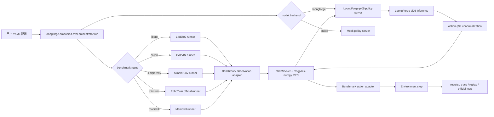

# LoongForge-VLA 离线评测用户说明

本文档说明如何在 `/workspace/LoongForge-VLA/loongforge/embodied/eval` 中使用统一 YAML 配置运行 LoongForge-VLA 离线评测。当前主要接入 LoongForge pi05 policy server，并已验证 LIBERO rollout 链路，同时提供 CALVIN、SimplerEnv、RoboTwin 和 ManiSkill 的 YAML 入口。

## 1. 模块定位

评测模块把 benchmark client 和 model server 解耦：

- benchmark 侧负责环境 reset/step、observation/action adapter、结果记录。
- model 侧通过独立 policy server 提供动作预测。
- 双方通过 WebSocket + msgpack-numpy RPC 通信。
- 用户入口是 YAML；命令行只传 `--config`。
- LoongForge 源码不在 eval 适配中被修改；兼容逻辑放在 `eval/servers`。

### 1.1 基于 LoongForge 的整体流程



### 1.2 数据链路

1. 用户只通过 `--config <yaml>` 启动评测，YAML 中的 `benchmark.name` 决定 benchmark runner，`model.backend` 决定 policy server backend。
2. orchestrator 读取 YAML 后启动 benchmark client，并按 `server.python` 拉起独立的 LoongForge pi05 policy server。
3. benchmark runner 从环境拿到原始 observation，由 benchmark-side adapter 转成统一 observation schema，包括图像、状态、语言指令和 episode/task 元信息。
4. observation 通过 WebSocket + msgpack-numpy RPC 发给 policy server。benchmark 侧不直接 import 或修改 LoongForge 模型代码。
5. LoongForge policy server 根据 YAML 构造 pi05 policy，加载 checkpoint 或按 `model.random_init: true` 随机初始化，然后执行真实 pi05 inference。
6. pi05 输出 normalized action chunk 后，server 按 LoongForge `dataset_statistics.json["action"]["q01"/"q99"]` 执行 q99 反归一化。
7. 反归一化后的 action 返回 benchmark client，再由 benchmark action adapter 转成具体环境需要的动作格式，例如 LIBERO/SimplerEnv/ManiSkill 的 7D action 或 RoboTwin 的 14D bimanual action。
8. 环境执行 step 后，runner 记录 episode 结果、trace、replay 或 RoboTwin official 日志。policy server 日志独立写入 `server.log`。

## 2. 已支持内容

| 项目 | 当前状态 |
|---|---|
| LoongForge pi05 server | 已支持 |
| LIBERO rollout | 已支持 |
| CALVIN long-horizon runner | 已接入 YAML 入口、独立 conda env 和 debug dataset；30-step smoke 已验证 reset/step/RPC/trace/summary |
| pi05 checkpoint / base model 加载 | 已验证 |
| action q99 反归一化 | 已按 LoongForge pi05 规范实现 |
| replay GIF / trace / summary 输出 | 已支持 |
| SimplerEnv rollout | 已接入 Bridge tasks、Vulkan runtime、trace/GIF 输出和固定小动作 sanity；当前模型结果仅作 smoke/debug，正式评测需要 Bridge/WidowX checkpoint 与 stats |
| RoboTwin official runner | 已接入 YAML 入口；random-init 14D pi05 已跑通 5-step official episode，正式评测需要 14D RoboTwin pi05 权重 |
| ManiSkill runner | 已接入 YAML 入口和 PickCube 7D 单臂 smoke 配置；正式评测需要 ManiSkill-compatible checkpoint 与 stats |

## 3. 环境要求

建议按职责隔离环境：

- benchmark 环境：运行 simulator client，不同 benchmark 使用各自 conda 环境，例如 LIBERO 使用 `/workspace/miniconda3/envs/libero/bin/python`，CALVIN 使用 `/workspace/miniconda3/envs/calvin/bin/python`，SimplerEnv 使用 `/workspace/miniconda3/envs/simplerenv/bin/python`，ManiSkill 使用 `/workspace/miniconda3/envs/maniskill/bin/python`。
- model server 环境：运行 LoongForge pi05，例如 `/workspace/miniconda3/envs/loongforge/bin/python`。

`lerobot==0.5.0` 要求 Python >= 3.12，因此 LoongForge pi05 server 不应使用旧的 Python 3.10 环境。各 benchmark 对应的 conda 隔离环境和关键依赖版本见 `benchmark_envs.md`。

## 4. YAML 配置结构

```yaml
benchmark:
  name: libero
  suite: libero_goal
  max_tasks: 1
  episodes_per_task: 1
  max_steps: 300
  num_steps_wait: 10

model:
  backend: loongforge
  model_type: pi05
  name: loongforge-pi05
  ckpt_path: /path/to/checkpoint_or_model_dir
  dataset_statistics_path: /path/to/dataset_statistics.json
  tokenizer_name: /path/to/paligemma-3b-pt-224
  action_dim: 7
  state_dim: 7
  action_horizon: 50
  max_action_dim: 32
  max_state_dim: 32
  use_bf16: false
  compile_model: false

server:
  host: 127.0.0.1
  port: 12093
  health_port: 12094
  python: /workspace/miniconda3/envs/loongforge/bin/python
  log: /path/to/policy_server.log
  start_timeout_sec: 900

env:
  eval_root: /workspace/LoongForge-VLA/loongforge/embodied/eval
  loongforge_root: /workspace/LoongForge-VLA
  libero_config_path: /path/to/libero_config
  mujoco_gl: osmesa
  pyopengl_platform: osmesa
  ld_library_path: /path/to/nvidia_lib

run:
  output_dir: /workspace/LoongForge-VLA/loongforge/embodied/eval/reports/pi05/libero/smoke_steps10
  seed: 7
  save_trace: true
  save_replay: true

timeouts:
  policy_call_ms: 600000
  per_step_sec: 600
  per_episode_sec: 900
```

关键字段：

- `benchmark.name` 决定 runner，目前 LIBERO 使用 `libero`。
- `model.backend` 使用 `loongforge`。
- `model.ckpt_path` 可以是包含 `model.safetensors` 的目录，也可以直接指向权重文件。
- `model.dataset_statistics_path` 用于 LoongForge pi05 action q99 反归一化。
- `server.python` 指向 LoongForge server 环境。
- `run.output_dir` 在 YAML 中写基准 run tag 目录，例如 `eval/reports/pi05/libero/smoke_steps10`；统一入口默认会在运行时生成时间戳目录，例如 `eval/reports/pi05/libero/20260624_191500_smoke_steps10`，避免复用旧 `results.jsonl`。

## 5. 运行 LIBERO

使用 examples 下的 pi05 LIBERO 启动脚本：

```bash
cd /workspace/LoongForge-VLA
examples/embodied/pi05/eval/run_libero_eval.sh
```

公开脚本使用 `/path/to/...` 占位配置。LIBERO 已提供 `libero_goal`、`libero_spatial`、`libero_object`、`libero_10` 四个 suite 的 smoke YAML，可通过 `CONFIG` 指定：

```bash
cd /workspace/LoongForge-VLA
CONFIG=examples/embodied/pi05/eval/configs/libero/object_smoke.yaml \
  examples/embodied/pi05/eval/run_libero_eval.sh
```

内部一键运行使用 `_internal.sh` 脚本，默认跑 `smoke_steps10_internal.yaml`。也可以通过 `CONFIG` 切到其他 internal suite：

```bash
cd /workspace/LoongForge-VLA
CONFIG=examples/embodied/pi05/eval/configs/libero/object_smoke_internal.yaml \
  examples/embodied/pi05/eval/run_libero_eval_internal.sh
```

## 6. 运行 CALVIN

CALVIN 是 7D Franka 长程语言操作评测，一条 sequence 连续执行 5 个 subtask。评测输出 `success_count`、Avg. Length，以及 Task 1-5 成功率。训练数据通常使用 LeRobot 格式，评测 runner 使用原始 CALVIN 格式，`benchmark.dataset_path` 需要指向包含 `validation/` 的目录。内部 debug smoke 已在 `/workspace/miniconda3/envs/calvin` 中跑通，使用 `/ssd1/sunyuehang/calvin_debug_dataset`、`/ssd1/sunyuehang/calvin/calvin_models/conf` 和 `/workspace/starVLA/examples/calvin/eval_files/eval_sequences.json`。

```bash
cd /workspace/LoongForge-VLA
examples/embodied/pi05/eval/run_calvin_eval.sh
```

公开脚本使用 `/path/to/...` 占位配置。内部一键运行使用 `_internal.sh` 脚本：

```bash
cd /workspace/LoongForge-VLA
examples/embodied/pi05/eval/run_calvin_eval_internal.sh
```

关键 CALVIN 字段：

```yaml
benchmark:
  name: calvin
  suite: task_D_D
  dataset_path: /path/to/calvin/task_D_D
  calvin_config_path: /path/to/calvin/calvin_models/conf
  eval_sequences_path: /path/to/calvin/eval_sequences.json
  num_sequences: 1
  max_steps_per_subtask: 360
```

## 7. 运行 SimplerEnv

使用 examples 下的 pi05 SimplerEnv 启动脚本：

```bash
cd /workspace/LoongForge-VLA
examples/embodied/pi05/eval/run_simplerenv_eval.sh
```

公开脚本使用 `/path/to/...` 占位配置。默认任务是 `widowx_put_eggplant_in_basket`。也可以通过 `CONFIG` 切换到其他 Bridge task：

```bash
cd /workspace/LoongForge-VLA
CONFIG=examples/embodied/pi05/eval/configs/simplerenv/carrot_on_plate_60step.yaml \
  examples/embodied/pi05/eval/run_simplerenv_eval.sh
```

当前提供的 SimplerEnv Bridge task 配置包括：

- `eggplant_300step.yaml`: `widowx_put_eggplant_in_basket`
- `carrot_on_plate_60step.yaml`: `widowx_carrot_on_plate`
- `stack_cube_60step.yaml`: `widowx_stack_cube`
- `spoon_on_towel_60step.yaml`: `widowx_spoon_on_towel`

内部一键运行使用 `_internal.sh` 脚本，也支持 `CONFIG` 覆盖：

```bash
cd /workspace/LoongForge-VLA
CONFIG=examples/embodied/pi05/eval/configs/simplerenv/carrot_on_plate_60step_internal.yaml \
  examples/embodied/pi05/eval/run_simplerenv_eval_internal.sh
```

该配置使用 `benchmark.name: simplerenv`，benchmark client 运行在 SimplerEnv 环境，policy server 由 YAML 中的 `server.python` 启动。runner 会在导入 SAPIEN 前自动设置并重启一次 Python 进程，使 `LD_LIBRARY_PATH`、`VK_ICD_FILENAMES` 和 `XDG_RUNTIME_DIR` 对 Vulkan renderer 生效；内部环境默认使用 `/ssd1/opt/nvidia_lib/10_nvidia.json`。

当前 SimplerEnv 接入状态：runner、YAML 配置、Vulkan/SAPIEN headless runtime、Bridge task reset/step、trace 和 GIF 输出均已打通；固定小尺度 action sanity check 已验证 WidowX controller 可以驱动机械臂。当前内部 pi05 SimplerEnv 配置使用 LIBERO 域 checkpoint 或空 `dataset_statistics_path`，只能作为链路 smoke/debug，不作为可信 SimplerEnv benchmark score。正式 SimplerEnv 评测需要 Bridge/WidowX/SimplerEnv 对应的 pi05 checkpoint 和匹配的 `dataset_statistics.json`；如果临时加入 action scale 让 GIF 动起来，应明确标注为 debug adapter，不计入正式结果。

### SAPIEN / Vulkan 排障

SimplerEnv、RoboTwin 和 ManiSkill 都依赖 SAPIEN 相关渲染栈。适配新 SAPIEN benchmark 前，先确认 Vulkan ICD，而不是只看 `nvidia-smi`。如果 `vulkaninfo` 只显示 `llvmpipe` 或 `lavapipe`，视觉观测、camera pipeline 或 replay 渲染可能段错误；state-only rollout 通过也不能说明视觉链路可用。

内部环境的快速检查命令：

```bash
LD_LIBRARY_PATH=/ssd1/opt/nvidia_lib:/usr/lib64:${LD_LIBRARY_PATH:-} \
VK_ICD_FILENAMES=/ssd1/opt/nvidia_lib/10_nvidia.json \
vulkaninfo
```

期望输出里能看到 `deviceName = NVIDIA ...` 和 `driverName = NVIDIA`。runner 需要在 import SAPIEN、svulkan2、ManiSkill 或 benchmark renderer 前设置 `LD_LIBRARY_PATH`、`VK_ICD_FILENAMES`、`XDG_RUNTIME_DIR`，必要时 re-exec 当前 Python 进程；Python 启动后再临时改 `LD_LIBRARY_PATH` 通常不够。

## 8. 运行 ManiSkill

ManiSkill 是基于 SAPIEN 的 GPU-friendly 操作 benchmark。当前接入的是 7D 单臂 smoke 路线，默认任务为 `PickCube-v1`，控制模式为 `pd_ee_delta_pose`。

使用 examples 下的 pi05 ManiSkill 启动脚本：

```bash
cd /workspace/LoongForge-VLA
examples/embodied/pi05/eval/run_maniskill_eval.sh
```

公开脚本使用 `/path/to/...` 占位配置。内部一键运行使用 `_internal.sh` 脚本：

```bash
cd /workspace/LoongForge-VLA
examples/embodied/pi05/eval/run_maniskill_eval_internal.sh
```

关键 ManiSkill 字段：

```yaml
benchmark:
  name: maniskill
  task_name: PickCube-v1
  robot_uid: panda
  control_mode: pd_ee_delta_pose
  obs_mode: rgbd
  sim_backend: auto
  render_backend: gpu
  camera_name: base_camera
```

当前 ManiSkill 接入状态：runner、adapter、YAML 配置和启动脚本已接入统一 orchestrator。`/workspace/miniconda3/envs/maniskill` 中 `torch`、`mani_skill`、`gymnasium`、`sapien` 导入已验证通过；`PickCube-v1` 在当前宿主机上可通过 `obs_mode=state`、`sim_backend=auto`、`render_backend=gpu` 完成 reset/step smoke。当前宿主机使用 `/ssd1/opt/nvidia_lib/10_nvidia.json` 和 `/ssd1/opt/nvidia_lib` 可枚举 A800 Vulkan GPU，`mock_rgbd_smoke.yaml` 已完成 `rgbd` 视觉链路的 orchestrator + mock policy RPC smoke；`pick_cube_20step_internal.yaml` 已完成 pi05 random-init action RPC smoke，可完成 policy server 启动、WebSocket action RPC、ManiSkill 5-step rollout、trace、summary 和 replay GIF 输出。server health 已改为 policy 构造完成后再 ready，避免误判。由于当前仍是 random-init 或 LIBERO 域 pi05 checkpoint/stats，不作为可信 ManiSkill benchmark score。正式 ManiSkill 评测需要 ManiSkill-compatible checkpoint 和匹配的 `dataset_statistics.json`。

## 9. 运行 RoboTwin

RoboTwin 官方任务是双臂 14D action。当前 LIBERO/SimplerEnv/ManiSkill pi05 checkpoint 是 7D action，因此真实 RoboTwin 评测需要 14D RoboTwin pi05 checkpoint 和对应 `dataset_statistics.json`。

仓库提供的 random-init 配置用于验证 LoongForge pi05 server 与 RoboTwin official runner 的通信链路，不加载 checkpoint，但会构造真实 14D pi05 模型并执行 policy inference：

```bash
cd /workspace/LoongForge-VLA
examples/embodied/pi05/eval/run_robotwin_eval.sh
```

公开脚本使用 `/path/to/...` 占位配置。内部一键运行使用 `_internal.sh` 脚本：

```bash
cd /workspace/LoongForge-VLA
examples/embodied/pi05/eval/run_robotwin_eval_internal.sh
```

`examples/embodied/pi05/eval/configs/robotwin/random_init_5step.yaml` 已验证 server 启动、evaluator 连接、policy action 调用、环境 step 均跑通。`examples/embodied/pi05/eval/configs/robotwin/bridge_7d_smoke.yaml` 中的 `model.robotwin_action_bridge: duplicate_7d` 只用于 7D checkpoint 的接口 smoke，不作为正式评测。正式 RoboTwin 评测应使用 14D checkpoint，并设置：

```yaml
model:
  action_dim: 14
  dataset_statistics_path: /path/to/robotwin_14d_dataset_statistics.json
```

## 10. 输出文件

LIBERO / CALVIN / SimplerEnv / ManiSkill rollout 会在 `run.output_dir` 下生成：

| 文件 | 说明 |
|---|---|
| `results.jsonl` | episode 级结果 |
| `summary.csv` | task 级聚合 |
| `suite_summary.csv` | suite 级聚合 |
| `artifacts/.../replay_*.gif` | replay GIF |
| `artifacts/.../trace_*.json` | 每步 action trace |

RoboTwin 特殊是因为评测模块复用 RoboTwin 官方 evaluator，该 evaluator 需要通过 `policy_name` import 一个 policy 插件入口；LIBERO/SimplerEnv/ManiSkill 则由本模块 runner 直接控制 reset/step。RoboTwin bridge 位于 `loongforge.embodied.eval.bridges.robotwin_policy`，会额外写 `trace.json`，记录每步 state、raw action、最终 14D action 和 latency。RoboTwin official runner 原生结果会写到 `/workspace/RoboTwin/eval_result/.../_result.txt`。开启视频时，官方结果目录还会生成 `*.mp4`；评测模块会在运行结束后把 RoboTwin official 日志、deploy config、`_result.txt`、`trace.json` 和可用 `mp4` 视频统一收集到 `run.output_dir/artifacts/robotwin/<task_name>/<task_config>/`。RoboTwin 不强制转换 GIF，视频产物保留为官方 `mp4`。policy server 日志由 `server.log` 指定。

### 9.1 configs / reports 目录约定

配置和报告都按模型、benchmark、单次运行组织。后续新增 benchmark 时也必须沿用这个标准，不要再把不同 benchmark 的配置或产物平铺在同一层。

```text
eval/
  configs/
    <model>/
      <benchmark>/
        <run_name>.yaml
  reports/
    <model>/
      <benchmark>/
        <run_name>/
          policy_server.log
          results.jsonl
          summary.csv
          suite_summary.csv
          artifacts/
            ... benchmark-specific trace / replay / video / official logs ...
```

YAML 中的 `run.output_dir` 应写到稳定 run tag 目录，例如 `reports/pi05/robotwin/random_init_5step`。统一入口默认启用 `run.timestamped_output: true`，实际运行时会创建 `<yyyymmdd_hhmmss>_<run_tag>` 目录，例如 `reports/pi05/robotwin/20260624_111252_random_init_5step`。`reports/` 是本地运行产物，不随代码提交。如需复用固定目录调试，可显式设置 `run.timestamped_output: false`。历史验证记录可使用稳定别名，例如 `smoke_steps10`、`base_300step`、`eggplant_300step`、`random_init_5step`。

目录语义：

- `<model>`：被评测模型，例如 `pi05`、`mock` 或后续新增模型名。
- `<benchmark>`：benchmark family，例如 `libero`、`calvin`、`simplerenv`、`robotwin`、`maniskill`。
- `<run_name>`：一次可复现运行；默认由统一入口按 `<timestamp>_<run_tag>` 生成，`run_tag` 来自 YAML 中 `run.output_dir` 的最后一级目录或 `run.run_name`。
- `policy_server.log`：模型 server 日志，保留在 run 根目录。
- `results.jsonl`、`summary.csv`、`suite_summary.csv`：标准评测汇总文件；如果 benchmark 原生不直接生成，应在 adapter/runner 中尽量补齐。
- `artifacts/`：benchmark 相关产物统一入口；内部层级可按 runner 特性组织，例如 LIBERO 使用 `artifacts/<task_suite>/...`，SimplerEnv 使用 `artifacts/simplerenv/<task>/...`，ManiSkill 使用 `artifacts/maniskill/<task>/...`，RoboTwin 使用 `artifacts/robotwin/<task>/<task_config>/...`。

RoboTwin official runner 会在运行时生成 worker-local 文件和 bridge config。评测模块只保留已归档到 `artifacts/robotwin/...` 的 official log、deploy config、`_result.txt`、`trace.json` 和可用 `mp4` 视频；运行时 `worker_files/` 不作为最终报告保留。

## 10. 已验证记录

已验证内部 LoongForge pi05 权重可以完成 server 启动、RPC 推理和 LIBERO 300-step rollout。公开配置中相关 checkpoint、tokenizer、dataset statistics 和本地驱动路径均使用 `/path/to/...` 占位；内部一键运行使用 `_internal.sh` 脚本和 `_internal.yaml` 配置。

LIBERO 结果执行满 300 step，但未完成任务，结果为 `not_successful_within_max_steps`。这说明评测链路已接通，但当前验证权重不是可完成该 LIBERO 任务的 checkpoint。

CALVIN debug smoke 已完成 1 条 sequence 的首个 subtask 30-step rollout，输出 `results.jsonl`、`summary.csv` 和 `artifacts/calvin/sequence0/trace_successes0.json`。当前使用 LIBERO 域 pi05 checkpoint，因此 `success_count=0` 只作为链路验证，不作为正式 CALVIN long-horizon score。

SimplerEnv Bridge runner 已完成 runtime smoke：`widowx_carrot_on_plate` 60-step rollout 可输出 replay GIF 和 trace，固定小尺度 action sanity 已验证 WidowX controller 能动。当前 SimplerEnv 内部配置仍使用 LIBERO 域 checkpoint 或空 `dataset_statistics_path`，因此只作为链路 smoke/debug，不作为正式 benchmark score。`examples/embodied/pi05/eval/configs/robotwin/random_init_5step.yaml` 已完成 5-step RoboTwin official episode，结果为 0/1 success，符合随机初始化权重预期；后续运行会把 RoboTwin official 结果、bridge `trace.json` 和可用 `mp4` 视频统一归档到 `artifacts/robotwin/...`。ManiSkill 当前已提供 `PickCube-v1` 20-step YAML 和 runner，用于后续环境 smoke。当前 7D checkpoint/action stats 未作为正式 RoboTwin 或 ManiSkill 成功率评测。

## 11. 添加新模型评测

后续如果要接入 pi05 之外的新模型，建议沿用当前 pi05 的模式：benchmark 侧保持统一协议和 adapter，模型差异只放在 policy server backend 中，不修改 benchmark runner，也不侵入 LoongForge 主框架源码。

### 10.1 推荐接入方式

1. 新增或复用一个 `model.backend`。
   - 如果新模型仍属于 LoongForge 框架，可以在 `eval/servers` 下新增对应 policy adapter，例如 `xxx_policy.py`。
   - 如果是完全不同框架，建议新增独立 server entrypoint，例如 `xxx_server.py`，仍然实现同一套 WebSocket RPC 协议。
2. 在 policy adapter 中完成模型私有逻辑。
   - 加载模型配置、tokenizer、checkpoint。
   - 将统一 observation schema 转成模型输入。
   - 执行模型 inference。
   - 将模型输出 action 转成统一 action schema。
   - 按模型自己的训练规范做 action unnormalization 或后处理。
3. 在 orchestrator 中注册 backend。
   - 参考当前 `model.backend: loongforge` 的启动方式。
   - 让 YAML 中的 `server.python`、`server.module`、`server.log` 等字段决定 server 如何启动。
   - 保持用户入口仍然只有 `--config <yaml>`。
4. 新增 YAML 示例。
   - 至少提供一个 smoke 配置，包含 `benchmark.name`、`model.backend`、模型路径、统计文件、server 环境和输出目录。
   - 配置文件按 `examples/embodied/pi05/eval/configs/<benchmark>/<run_name>.yaml` 组织，例如 `examples/embodied/pi05/eval/configs/libero/smoke_steps10.yaml`。
   - `run.output_dir` 必须指向对应的 `reports/<model>/<benchmark>/<run_name>/`，`server.log` 放在同一 run 目录下。
   - 如果模型支持多个 benchmark，分别提供 LIBERO / CALVIN / SimplerEnv / RoboTwin / ManiSkill 等配置，不要依赖额外 CLI 参数。
5. 加最小验证。
   - 先用 mock 或 random-init 验证 server 和 benchmark runner 能通信。
   - 再用真实 checkpoint 跑短 rollout。
   - 最后按 benchmark 需求增加步数或 episode 数。

### 10.2 新模型需要确认的字段

```yaml
model:
  backend: your_backend_name
  model_type: your_model_type
  name: your_model_name
  ckpt_path: /path/to/checkpoint
  dataset_statistics_path: /path/to/dataset_statistics.json
  tokenizer_name: /path/to/tokenizer_or_processor
  action_dim: 7
  state_dim: 7
  action_horizon: 50
  use_bf16: false
```

其中最关键的是 action 相关字段：

- `action_dim` 必须和 benchmark 需要的动作维度一致。LIBERO/SimplerEnv/ManiSkill 当前是 7D，RoboTwin official 是 14D bimanual。
- `dataset_statistics_path` 必须和该模型训练时使用的 action normalization 规则匹配。
- 如果模型没有 q99 归一化，不能复用 pi05 的反归一化逻辑，应在新 policy adapter 中实现模型自己的 inverse transform。
- 如果只是验证通信链路，可以提供 `random_init` 或临时把 YAML 的 `model.backend` 改成 `mock`；mock backend 不是 pi05 示例，不单独提供配置文件。正式评测必须使用训练好的 checkpoint 和匹配的统计文件。

### 10.3 推荐目录改动

```text
eval/
  configs/
    your_model/
      libero/
        smoke.yaml
      simplerenv/
        smoke.yaml
      robotwin/
        smoke.yaml
  reports/
    your_model/
      libero/
        smoke/
      simplerenv/
        smoke/
      robotwin/
        smoke/
  servers/
    your_model_policy.py
    your_model_server.py
```

如果新模型和 pi05 同属 LoongForge 且 server 启动方式一致，也可以只新增 policy adapter，并复用现有 server 的公共逻辑。无论哪种方式，benchmark adapter 和 protocol schema 都应保持稳定。

### 10.4 验证清单

- YAML 可以通过 `python -m loongforge.embodied.eval.orchestrator.run --config <yaml>` 启动。
- policy server 可以独立启动并通过 health check。
- benchmark observation 能被新模型 adapter 正确解析。
- 模型 action 输出维度和 benchmark action adapter 预期一致。
- action unnormalization 使用的是该模型自己的训练统计和公式。
- 短 rollout 能生成结果文件和 server log。
- 文档中明确该模型支持哪些 benchmark，以及哪些配置只是 smoke/debug，不是正式成功率评测。

## 12. LoongForge pi05 Action 反归一化

LoongForge pi05 使用 quantile/q99 归一化：

```text
norm = 2 * (x - q01) / (q99 - q01) - 1
x = (norm + 1) / 2 * (q99 - q01) + q01
```

评测 adapter 从 `model.dataset_statistics_path` 读取 `dataset_statistics.json["action"]["q01"]` 和 `q99`，对模型输出 action chunk 做反归一化。gripper 的环境语义转换交给 benchmark adapter，例如 LIBERO adapter。

当前 LeRobot mean/std 兼容逻辑主要用于 LIBERO LeRobot 权重适配。CALVIN debug smoke 使用的是 LoongForge pi05 q99 反归一化，再由 CALVIN adapter 按 CALVIN relative action 约定缩放到 env action；它不是 LeRobot mean/std 路径。SimplerEnv 当前没有 Bridge/WidowX 对应 `dataset_statistics.json`，ManiSkill 当前没有 ManiSkill-compatible `dataset_statistics.json`，因此都只作为 smoke/debug，正式评测需要匹配 checkpoint 与 stats。

## 13. 验证范围

当前已验证主链路包括：

- `run.py`、`config.py`、`server_manager.py`。
- `libero_runner.py`：pi05 LIBERO 时间戳目录运行，`new_records: 1`。
- `simplerenv_runner.py`：SimplerEnv Bridge runtime smoke、60-step carrot rollout 和固定小动作 sanity；模型分数仍为 debug/smoke。
- `robotwin_runner.py`：pi05 RoboTwin random-init 14D official runner。
- `maniskill_runner.py`：ManiSkill 7D single-arm PickCube smoke runner。
- `generate_report.py`、`compare_repro.py`、`archive_traces.py`：已基于真实 LIBERO `results.jsonl` 做轻量 CLI 验证。

TODO：后续如果需要多任务、多 endpoint 调度，再单独引入并验证 `orchestrator/scheduler.py` 和 `orchestrator/work_queue.py`。它们不属于当前 pi05 主链路，本次同步不作为已交付功能。

## 14. 常见问题

### server 启动看起来很慢

pi05 冷启动需要加载大模型。`server.start_timeout_sec` 建议设置为 900 秒。当前 LoongForge server 会提前启动 `/healthz`，避免 runner 在冷启动阶段误判卡死。

### 为什么 base model 或 steps_10 没成功

`pi05_base` 是 base model，`steps_10` checkpoint 训练步数很少。二者都能完成评测链路，但不代表具备完成 LIBERO 任务的能力。需要使用针对 LIBERO 或相近 Franka manipulation 数据训练充分的 checkpoint。

### 没有 replay GIF

确认 YAML 中：

```yaml
run:
  save_replay: true
```

GIF 会写入 `run.output_dir/artifacts/.../replay_*.gif`。
